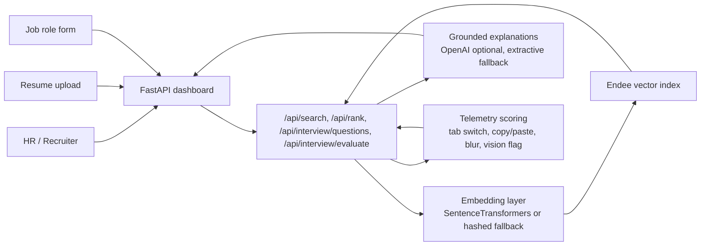

# Endee Atlas (RAG using Endee)

Endee Atlas is a RAG-based platform built with FastAPI and [Endee](https://github.com/endee-io/endee) as the vector database. It turns complex documents into embeddings, performs semantic search, ranks information with explainable scoring, and generates grounded AI insights.

The project is designed as a practical AI/ML demo for recruitment teams. It demonstrates:

- Semantic search over candidate resumes
- Explainable candidate ranking for job roles
- AI-assisted interview question generation
- Interview evaluation with fraud and cheating signals
- Resume improvement suggestions for shortlisted roles
- Retrieval-augmented explanations for HR decisions
- A live Endee connection path with a browser reconnect action

## What It Solves

Traditional workflows depend heavily on keywords and manual review. Endee Atlas uses embeddings plus Endee retrieval to help users:

- Find candidates by meaning, not keyword overlap
- Compare applicants against a role using transparent scoring
- Ask role-specific interview questions automatically
- Detect suspicious interview behavior such as tab switching, copy/paste spikes, and camera review flags
- Explain why a candidate ranked highly or where they are still weak

## System Design



### Data Flow

1. A resume is uploaded from the browser as `.txt` or `.md`.
2. The browser reads the file contents and sends them to the FastAPI backend.
3. Resume text and job descriptions are embedded into 384-dimensional vectors.
4. Endee stores the vectors and supports nearest-neighbor retrieval.
5. Semantic search and ranking reuse the same retrieval layer.
6. Interview questions and evaluation reuse the same candidate and job context.
7. Fraud telemetry feeds into a deterministic integrity score.

## How Endee Is Used

Endee is the vector database for the whole project.

- Candidate resumes and job descriptions are upserted with vector embeddings.
- The project uses cosine similarity for semantic matching.
- Payload metadata stores candidate name, role, location, stage, skills, and source.
- Filters narrow retrieval by role, location, and screening stage.
- The same vector index powers:
  - Candidate search
  - Candidate ranking
  - Similar candidate recommendations
  - Retrieval-grounded recruiter explanations

If Endee is unavailable, the app falls back to an in-memory vector store so the demo still runs locally and the tests remain deterministic.
If Endee comes online later, use the `Reconnect Endee` button in the header to switch back to the real vector store and reindex the loaded corpus.

## Features

### Candidate Side

- Upload resume files
- Receive resume improvement suggestions
- View interview feedback and fraud signals

### HR / Recruiter Side

- Create job roles
- Run semantic candidate search
- Rank candidates with explainable AI
- Generate adaptive interview questions
- Evaluate interview answers
- Inspect telemetry-based fraud risk
- Ask grounded hiring questions and get cited answers

## How To Use

1. Check the connection card in the header. If Endee is available, the status will show `connected`; otherwise you can use the `Reconnect Endee` button.
2. Upload `.txt` or `.md` documents to build the searchable corpus.
3. Run semantic search to find the best matches by meaning, not keywords.
4. Rank candidates or documents against a role/specification.
5. Open the explainability panel to get grounded answers from the retrieved context.

## Project Structure

```text
app/
  main.py              FastAPI routes and app startup
  knowledge_base.py     Endee wrapper, ingest, search, ranking, interview logic
  scoring.py            Explainable scoring, interview scoring, fraud scoring
  vector_store.py       Endee client wrapper plus in-memory fallback
  sample_corpus.py      Seed candidates and job roles
  rag.py                Grounded answer generation helpers
  templates/            HTML dashboard
  static/                Browser UI logic and styles
tests/                  Unit tests for filters, scoring, vector store, and API flow
docker-compose.yml      Endee + app together
Dockerfile              App container
```

## Setup

### 1. Mandatory GitHub Steps

Before starting the project in a real submission flow:

1. Star the official Endee repository: <https://github.com/endee-io/endee>
2. Fork the repository to your personal GitHub account
3. Use the forked repository as the base for your project
4. Push this project repo to your own GitHub account

### 2. Start with Docker

```bash
docker compose up --build
```

- Endee runs on `http://localhost:8080`
- The app prefers Endee, waits briefly for it at startup, and reconnects from the UI if needed
- Endee Atlas runs on `http://localhost:8000`

### 3. Run locally without Docker

```bash
python -m venv .venv
.venv\Scripts\Activate.ps1
pip install -r requirements.txt
```

Start Endee separately:

```bash
docker run -p 8080:8080 -v ./endee-data:/data --name endee-server endeeio/endee-server:latest
```

Then launch the app:

```bash
uvicorn app.main:app --reload --host 0.0.0.0 --port 8000
```

### 4. Environment Variables

Copy `.env.example` to `.env` and edit it if needed.

- `APP_NAME` defaults to `Endee Atlas`
- `ENDEE_BASE_URL` defaults to `http://localhost:8080/api/v1`
- `ENDEE_INDEX_NAME` defaults to `talentforge_hiring`
- `VECTOR_STORE_BACKEND` defaults to `auto`
- `EMBEDDING_BACKEND` defaults to `hash` for an offline-safe local run
- `EMBEDDING_MODEL` is only used when `EMBEDDING_BACKEND=sentence-transformers`
- `ENDEE_BOOTSTRAP_TIMEOUT_SECONDS` controls how long the app waits for Endee when `VECTOR_STORE_BACKEND=endee`
- `ENDEE_BOOTSTRAP_INTERVAL_SECONDS` controls the retry delay while waiting for Endee
- `OPENAI_API_KEY` enables richer grounded explanations
- `OPENAI_MODEL` controls the optional chat model
- `SEED_SAMPLE_DATA` preloads sample candidates and job roles

If `OPENAI_API_KEY` is not set, the app still works and falls back to deterministic explainability and interview generation.
If `EMBEDDING_BACKEND` is left at the default `hash`, the app starts immediately without downloading models.
If Endee is not available at startup, the homepage shows the fallback state and the UI keeps the reconnect action visible.

## Running Tests

```bash
python -m unittest discover -s tests
```

## API Highlights

- `GET /api/status` returns vector store status, seeded counts, and filter catalogs
- `POST /api/search` performs semantic candidate search
- `POST /api/rank` ranks candidates for a job role
- `POST /api/interview/questions` generates adaptive interview questions
- `POST /api/interview/evaluate` scores interview answers and fraud telemetry
- `POST /api/resume-feedback` suggests resume improvements
- `POST /api/fraud-score` scores interview integrity signals
- `POST /api/upload` indexes uploaded resume text from `.txt` or `.md` files

## Notes

- The browser reads resume files locally and sends the text to the API, so the demo stays lightweight and avoids multipart upload dependencies.
- Sample data is fictional and safe to replace with your own hiring corpus.
- The UI is single-page, responsive, and built to show explainable AI rather than a generic dashboard.
