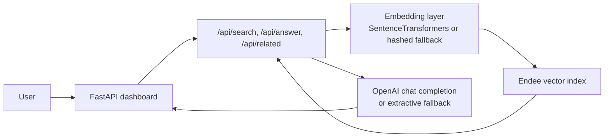

# InsightForge

InsightForge is a practical AI knowledge assistant built on top of [Endee](https://github.com/endee-io/endee), using it as the vector database for semantic search, recommendation, and retrieval-augmented generation.

The demo is intentionally focused on a realistic enterprise use case: teams need fast answers from internal docs, support playbooks, product FAQs, and policy material. InsightForge turns those documents into searchable chunks, stores them in Endee, and then uses retrieval to power both search and grounded answers.

## What It Does

- Semantic search across an internal knowledge corpus
- RAG-style answers with cited source passages
- Related-document recommendations from vector similarity
- Metadata filters for department, document type, and audience
- Upload support for new `.txt` and `.md` knowledge files

## System Design



### Data Flow

1. Sample documents or uploads are chunked into smaller passages.
2. Each chunk is embedded into a 384-dimensional vector.
3. The vectors, plus metadata filters, are upserted into Endee.
4. Search queries are embedded the same way and sent to Endee for nearest-neighbor retrieval.
5. The top matches feed semantic search results, related-document recommendations, and grounded answers.

## How Endee Is Used

Endee is the retrieval engine for the whole project.

- The index is created with `dimension=384`, `space_type="cosine"`, and `Precision.INT8`.
- Each chunk is stored with rich metadata such as department, document type, audience, source, and excerpt text.
- Filters use Endee payload conditions so the search can be narrowed by department, document type, or audience.
- The same index supports three user flows:
  - Search
  - Similarity recommendations
  - Retrieval-augmented answering

## Project Structure

```text
app/
  main.py              FastAPI routes and app startup
  knowledge_base.py    Endee wrapper, ingest, search, and answer orchestration
  embeddings.py        SentenceTransformer embedding with offline fallback
  rag.py               Grounded answer generation helpers
  sample_corpus.py     Fictional sample docs for the demo
  templates/           HTML template
  static/               UI styles and browser logic
tests/                 Unit tests for helper logic
docker-compose.yml     Endee + app together
Dockerfile             App container
```

## Setup

### 1. Start Endee and the app with Docker

```bash
docker compose up --build
```

- Endee runs on `http://localhost:8080`
- InsightForge runs on `http://localhost:8000`

### 2. Run locally without Docker

```bash
python -m venv .venv
.venv\Scripts\Activate.ps1
pip install -r requirements.txt
```

Start Endee separately using the quick-start container:

```bash
docker run -p 8080:8080 -v ./endee-data:/data --name endee-server endeeio/endee-server:latest
```

Then launch the app:

```bash
uvicorn app.main:app --reload --port 8000
```

### 3. Optional environment variables

Copy `.env.example` to `.env` and edit it if needed.

- `ENDEE_BASE_URL` defaults to `http://localhost:8080/api/v1`
- `ENDEE_INDEX_NAME` defaults to `insightforge_knowledge`
- `EMBEDDING_MODEL` defaults to `sentence-transformers/all-MiniLM-L6-v2`
- `OPENAI_API_KEY` enables generative answer synthesis
- `OPENAI_MODEL` controls the chat model used for RAG answers

If `OPENAI_API_KEY` is not set, the app still works and uses a retrieval-grounded extractive fallback.

## Running Tests

```bash
python -m unittest discover -s tests
```

## Example Questions

- What is the rollback process for a production release?
- How should support handle a Sev1 incident?
- How do I explain the product's security model to a customer?
- What is the remote work policy?
- What should I say when a prospect worries about price?

## GitHub Checklist

The company requirement includes a few repository steps before submission:

1. Star the official Endee repository: <https://github.com/endee-io/endee>
2. Fork the repository to your personal GitHub account
3. Use that fork as the base repository for your submission
4. Push this project repo to your own GitHub account

I could build the project files here, but I could not complete the GitHub account actions from this environment because GitHub authentication tooling is not available in the workspace.

## Notes

- Sample content in this repo is fictional and safe to replace with your own knowledge base.
- Uploaded documents are indexed into Endee immediately.
- The UI is single-page, responsive, and designed to show the retrieval pipeline clearly for a recruiter or reviewer.

